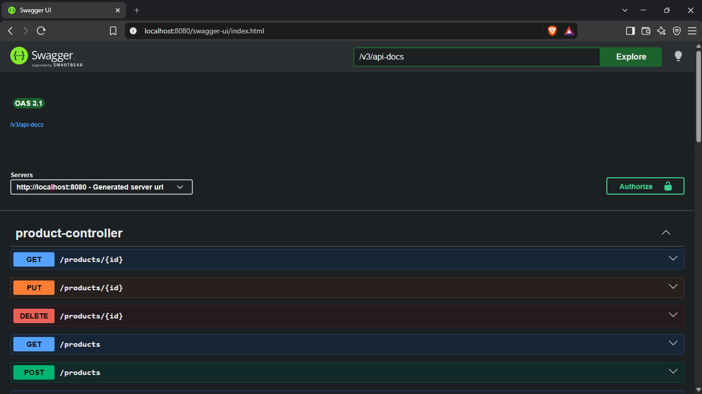

# Brand Product CRUD API

This project is a REST API built using Spring Boot for managing brands and products.

I built this project to practice backend development, REST APIs, database operations, and authentication using Spring Security and JWT.

## Features

- Create, read, update and delete products
- Manage product and brand data
- JWT based login authentication
- Role based authorization using USER and ADMIN roles
- BCrypt password encryption
- MySQL database integration
- Exception handling
- Swagger/OpenAPI documentation

## Authentication

The application has two roles:

- **USER** - can view products
- **ADMIN** - can view, create, update and delete products

Login endpoint:

```text
POST /auth/login
```

After login, the API returns a JWT token.

For protected APIs, the token is sent in the request header:

```text
Authorization: Bearer <token>
```

## Product APIs

| Method | Endpoint | Access |
|---|---|---|
| GET | `/products/**` | USER / ADMIN |
| POST | `/products/**` | ADMIN |
| PUT | `/products/**` | ADMIN |
| DELETE | `/products/**` | ADMIN |

## Swagger

Swagger UI is available when the application is running:

```text
http://localhost:8080/swagger-ui/index.html

```text
Swagger is used to view and test the API endpoints.

### Swagger UI



## Technologies

- Java 21
- Spring Boot
- Spring Web
- Spring Data JPA
- Spring Security
- JWT
- MySQL
- Maven
- Swagger / OpenAPI

## Database Configuration

The project uses MySQL.

Create the database:

```sql
CREATE DATABASE brandproductcrud;
```

Database password and other sensitive values are configured using environment variables.

Required environment variables:

```text
DB_PASSWORD
USER_PASSWORD
ADMIN_PASSWORD
JWT_SECRET
```

Actual passwords and secrets should not be committed to the repository.

## Running the Project

Clone the repository:

```bash
git clone https://github.com/adarshchaurasiya09/brandproductcrud.git
```

Configure the required environment variables and make sure MySQL is running.

Then run the application using Maven:

```cmd
mvnw.cmd spring-boot:run
```

Or run `BrandproductcrudApplication` directly from Eclipse.

Once the application starts, open Swagger:

```text
http://localhost:8080/swagger-ui/index.html
```

## Project Structure

```text
src/main/java/com/example/brandproductcrud
├── configer
├── controller
├── dto
├── entity
├── exception
├── filter
├── repository
├── service
└── BrandproductcrudApplication.java

src/main/resources
└── application.properties
```

## Author

Adarsh Chaurasiya